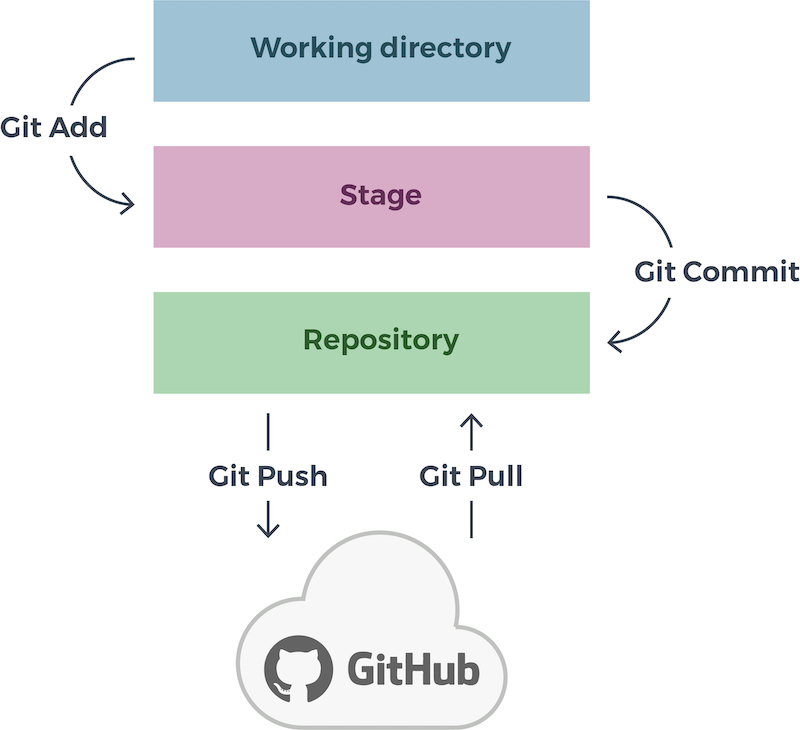
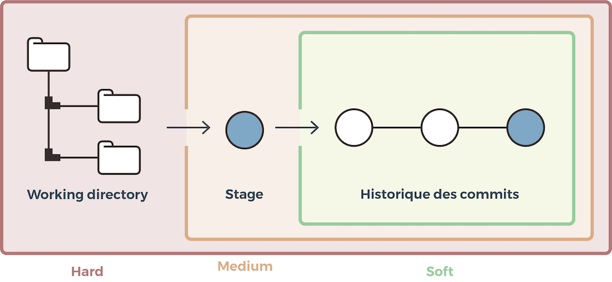
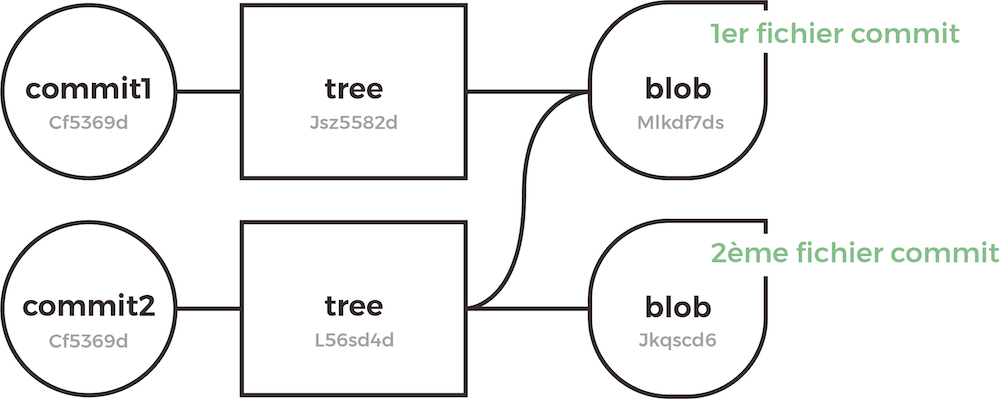
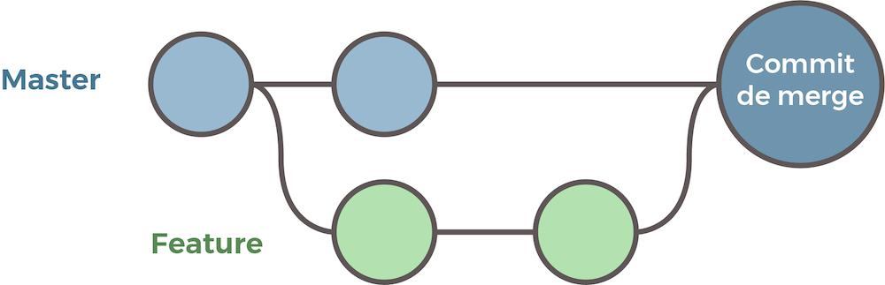
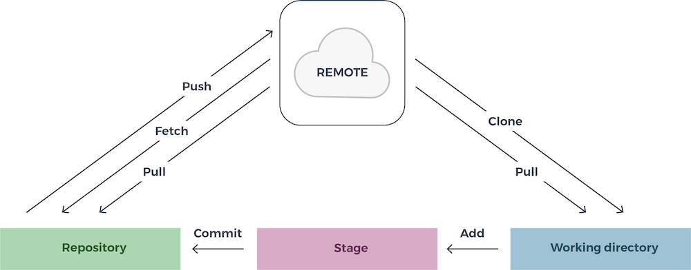
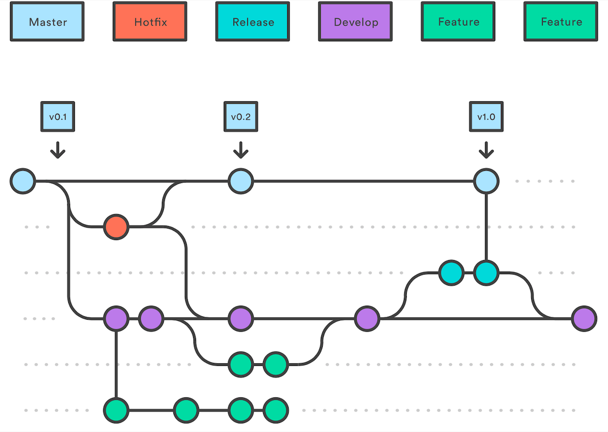

# Git

[](http://commonmark.org)

## Commandes de base

### Initialisez Git

La première chose à faire est de configurer son identité :

```bash
$ git config --global user.name "darthols"
$ git config --global user.email dartholco@gmail.com
```

Il est recommandé d’activer les couleurs afin d’améliorer la lisibilité des différentes branches :

```bash
$ git config --global color.diff auto
$ git config --global color.status auto
$ git config --global color.branch auto
$ git config --global color.ui auto
```

Par défaut, Git utilisera `Vim` comme éditeur et `Vimdiff` comme outil de merge. Vous pouvez les modifier en utilisant pour linux :

```bash
$ git config --global core.editor nano
$ git config --global diff.tool meld
$ git config --global merge.tool meld
```

ou pour windows :

```bash
$ git config --global core.editor notepad++.exe
$ git config --global merge.tool WinMergeU.exe
```

Il faut vérifier la présence de clés GPG et récupérer l'Id :

```bash
$ gpg --list-secret-keys --keyid-format LONG
/home/darthols/.gnupg/pubring.kbx
---------------------------------
sec   rsa4096/409F6F2946BDA3DF 2020-05-15 [SC]
      90B8A6E1767E75FFBC016CFA409F6F2946BDA3DF
uid                [  ultime ] @darthols <dartholco@gmail.com>
ssb   rsa4096/B73992D760C6BA5E 2020-05-15 [E]
```

Et paramétrer ensuite git pour l'associer :

```bash
$ git config --global commit.gpgsign true
$ git config --global user.signingkey 409F6F2946BDA3DF
```

Afin de vérifier que vos paramètres aient bien été pris en compte, et vérifier les autres paramètres, il suffit de passer la commande `git config --list` :

```bash
$ git config --list
user.name=darthols
user.email=dartholco@gmail.com
user.signingkey=409F6F2946BDA3DF
color.diff=auto
color.status=auto
color.branch=auto
color.ui=auto
commit.gpgsign=true
core.editor=nano
diff.tool=meld
merge.tool=meld
```

### Créer un dépôt local

```bash
$ mkdir monProjet && cd monProjet
$ git init
```

### Accéder à un dépôt distant

```bash
$ git remote add OC https://github.com/darthols/OpenclassroomProject.git
Clonage dans 'OpenclassroomProject'...
remote: Enumerating objects: 4, done.
remote: Counting objects: 100% (4/4), done.
remote: Compressing objects: 100% (3/3), done.
remote: Total 4 (delta 0), reused 0 (delta 0), pack-reused 0
Dépaquetage des objets: 100% (4/4), fait.
```

OC représente le nom court que vous utiliserez ensuite pour appeler votre dépôt. Appelez-le comme bon vous semble, mais un nom court et simple est toujours plus facile.

### Le système de branches

Pour connaître les branches présentes dans notre projet, il faut taper la ligne de commande `git branch` :

```bash
$ git branch
* master
```

L’étoile signifie que c’est la branche sur laquelle vous vous situez et que c’est sur celle-ci qu'actuellement vous réalisez vos modifications.

Pour créer une nouvelle branche en local :

```bash
$ git branch cagnotte
```

Pour basculer de branche, nous allons utiliser `git checkout` :

```bash
$ git checkout cagnotte

$ git branch
master
* cagnotte
```

### Réalisez un commit

Un commit est tout simplement un enregistrement de votre travail à un instant T sur la branche courante où vous êtes.

Pour ce faire, nous allons lui envoyer la commande : `git commit`

```bash
$ git commit -m "Réalisation de la partie cagnotte côté front end"
```

### Réalisez votre premier push

La commande `git push` permet d'envoyer les modifications que l'on a réalisées en local sur le dépôt à distance, alors que la commande `git pull` permet de récupérer en local le projet distant.

---

## Corrigez vos erreurs sur votre dépôt local

Git gère les versions de vos travaux locaux à travers 3 zones locales majeures :

* le répertoire de travail (working directory/WD) ;
* l’index, ou stage (nous préférerons le second terme) ;
* le dépôt local (Git directory/repository).



Ajouter des fichiers au stage avec `git add` :

```bash
$ git add process.py
```

Archivage dans le dépôt local avec `git commit` :

```bash
$ git commit -m "Version initiale."
```

Accéder à l'historique avec `git reflog` qui affichera toutes vos actions et leurs SHA qui sert d'identifiant aux actions :

```bash
$ git reflog
```

### Supprimer une branche créée par erreur

Pour supprimer une branche que nous venons de créer, il suffit d'exécuter la comil `git branch -d` :

```bash
$ git branch -d brancheTest
```

Attention, si toutefois vous avez déjà fait des modifications dans la branche que vous souhaitez supprimer, il faudra soit faire un commit de vos modifications, soit mettre vos modifications de côté, soit forcer la suppression en faisant :

```bash
$ git branch -D brancheTest
```

### Modifications faites dans une branche sans commit

Vous avez modifié votre branche master avant de créer votre branche et vous n'avez pas fait le commit. Nous allons faire ce qu'on appelle une remise. La remise va permettre de mettre vos modifications de côté, le temps de créer votre nouvelle branche et ensuite appliquer cette remise sur la nouvelle branche.

```bash
$ git status
On branch master
Changes to be committed:
  (use "git restore --staged <file>..." to unstage)
        new file:   README.md
```

Nous allons donc créer une remise.

```bash
$ git stash
Saved working directory and index state WIP on master: d0b5002 Version initiale.
```

Vous pouvez maintenant vous assurer que votre branche master est de nouveau propre, en faisant un nouveau `git status` :

```bash
$ git status
On branch master
nothing to commit, working tree clean
```

Nous allons maintenant créer notre branche "brancheCommit".

```bash
$ git branch brancheCommit
```

Nous allons basculer sur cette branche.

```bash
$ git checkout brancheCommit
```

Et finalement, nous allons pouvoir appliquer la remise, afin de récupérer nos modifications sur notre nouvelle branche.

```bash
$ git stash apply
On branch brancheCommit
Changes to be committed:
  (use "git restore --staged <file>..." to unstage)
        new file:   README.md
```

Cette commande va appliquer la dernière remise qui a été faite. Si pour une raison ou une autre, vous avez créé plusieurs remises, et que la dernière n'est pas celle que vous souhaitiez appliquer, pas de panique, il est possible d'appliquer une autre remise.

Nous allons d'abord regarder la liste de nos remises. Pour ce faire :

```bash
$ git stash list
stash@{0}: WIP on master: d0b5002 Version initiale.
```

Il suffira alors d'appeler la commande git stash  en indiquant l'identifiant :

```bash
$ git stash apply stash@{0}
On branch brancheCommit
Changes to be committed:
  (use "git restore --staged <file>..." to unstage)
        new file:   README.md
```

### Modifications faites dans une branche avec commit

Nous allons devoir aller analyser vos derniers commits avec la fonction  `git log`, afin de pouvoir récupérer l'identifiant du commit que l'on appelle couramment le hash. Par défaut, `git log` va vous lister par ordre chronologique inversé tous vos commits réalisés :

```bash
$ git log
commit a5f8baccca227ec4d65f1f47421b979955ed3040 (HEAD -> brancheCommit)
Author: Olivier Soupert <osoupert@onet.fr>
Date:   Fri Apr 10 19:04:13 2020 +0200

    Version initiale.

commit d0b5002b14bd5746af7bbd87942f1dea1bc0ec07 (master)
Author: Olivier Soupert <osoupert@onet.fr>
Date:   Fri Apr 10 17:17:13 2020 +0200

    Version initiale.
```

Maintenant que vous disposez de votre identifiant, gardez-le bien de côté. Vérifiez bien que vous êtes sur la branche conernée et réalisez la commande suivante `git reset` :

```bash
$ git reset --hard HEAD^
```

Cette ligne de commande va permettre de supprimer de la branche actuelle votre dernier commit.  Le Head^ indique que c'est bien le dernier commit que nous voulons supprimer.

Nous allons maintenant créer notre nouvelle branche et basculer sur cette branche.

```bash
$ git branch brancheCommit
$ git checkout brancheCommit
```

Maintenant que nous sommes sur la bonne branche, nous allons de nouveau faire un `git reset`, mais celui-ci va permettre d'appliquer ce commit sur notre nouvelle branche ! Il n'est pas nécessaire d'écrire l'identifiant en entier. Seuls les 8 premiers caractères sont nécessaires.

```bash
$ git reset a5f8baccca227ec4d65f1f47421b979955ed3040
Unstaged changes after reset:
D       README.md
```

### Changer le message d'un commit

Imaginons que vous veniez de faire un commit et que vous ayez fait une erreur dans votre message. L'exécution de cette commande, lorsqu'aucun élément n'est encore modifié, vous permet de modifier le message du commit précédent sans modifier son instantané. L'option -m permet de transmettre le nouveau message :

```bash
$ git commit --amend -m "Votre nouveau message de commit"
[brancheCommit 3ccacb4] Votre nouveau message de commit
 Date: Fri Apr 10 17:17:13 2020 +0200
 2 files changed, 253 insertions(+)
 create mode 100644 Vasarely/Vasarely.py
 create mode 100644 Vasarely/deformation.py
```

### J’ai oublié un fichier dans mon dernier commit

Nous allons réutiliser la commande `git --amend`, mais d'une autre manière. La fonction `git --amend`, si vous avez bien compris, permet de modifier le dernier commit.

Nous allons donc réutiliser cette fonction, mais sans le -m qui permettait de modifier son message.

Nous allons dans un premier temps ajouter notre fichier, et dans un deuxième temps réaliser le `git --amend`.

```bash
$ git add FichierOublie.txt
$ git commit --amend --no-edit
```

---

## Corrigez vos erreurs sur votre dépôt distant

### Corrigez vos erreurs en local et à distance

La journée avait été difficile et par mégarde vous avez pushé des fichiers erronés. Le problème, c'est que maintenant ce n'est plus que sur votre dépôt local, mais à disposition de tout le monde. La première chose à faire est de prévenir vos collaborateurs.

Il est possible d'annuler son commit public avec la commande `git revert`. L'opération Revert annule un commit en créant un nouveau commit. C'est une méthode sûre pour annuler des changements, car elle ne risque pas de réécrire l'historique du commit.

```bash
$ git revert HEAD^
```

Nous avons maintenant reverté notre dernier commit public et cela a créé un nouveau commit d'annulation. Cette commande n'a donc aucun impact sur l'historique ! Par conséquent, il vaut mieux utiliser `git revert` pour annuler des changements apportés à une branche publique, et `git reset` pour faire de même, mais sur une branche privée.

---

## Git reset

### Les trois types de réinitialisation de Git

La commande `git reset` est un outil complexe et polyvalent pour annuler les changements. Elle peut être appelée de trois façons différentes, qui correspondent aux arguments de ligne de commande --soft, --mixed et --hard.



#### git reset hard

`git reset hard` va permettre de revenir à n'importe quel commit mais en oubliant absolument tout ce qu'il s'est passé après !

```bash
$ git reset notreCommitCible --hard
HEAD is now at 5c110c3 modification temporaire
```

#### git reset mixed

Le `git reset --mixed` va permettre de revenir juste après votre dernier commit ou le commit spécifié, sans supprimer vos modifications en cours. Il va par contre créer un HEAD détaché. Il permet aussi, dans le cas de fichiers indexés mais pas encore commités, de désindexer les fichiers.

```bash
$ git reset HEAD~
```

Si rien n'est spécifié après `git reset`, par défaut il exécutera un `git reset --mixed HEAD~`.

#### git reset soft

Nous avons enfin le git reset --Soft. Le git reset --Soft permet juste de se placer sur un commit spécifique afin de voir le code à un instant donné ou créer une branche partant d'un ancien commit. Il ne supprime aucun fichier, aucun commit, et ne crée pas de HEAD détaché.

Le HEAD, si vous n'êtes pas sûr d'avoir bien compris, est un pointeur, une référence sur notre position actuelle dans notre répertoire de travail Git. Par défaut, HEAD pointe sur la branche courante, master, et peut être déplacé vers une autre branche ou un autre commit.

### J’ai ajouté le mauvais fichier au commit

Vous avez fait un commit mais un fichier s'est glissé par "erreur". Avec Git nous avons une super fonction qui va remonter le temps. Elle va réaliser une sorte de Undo, mais en faisant un deuxième commit. Elle ne va pas revenir en arrière et supprimer votre commit, mais va inverser vos actions dans le commit et réaliser un second commit. Au lieu de supprimer le commit de l'historique du projet, elle détermine comment annuler les changements introduits par le commit et ajoute un nouveau commit avec le contenu ainsi obtenu.  Vous allez donc revenir à l'état précédent mais avec un nouveau commit. Ainsi, Git ne perd pas l'historique, lequel est important pour l'intégrité de votre historique de révision et pour une collaboration fiable.

La différence entre Revert et Reset est que Reset va revenir à l'état précédent sans créer un nouveau commit, alors que Revert va créer un nouveau commit.


Essayons cette super commande en faisant un premier commit que nous allons finalement ne plus vouloir. Une fois votre commit fait, écrivez la commande suivante :

```bash
$ git revert HEAD
```

Une fois, votre commit "annulé", vous allez pouvoir enlever votre fichier, et réaliser de nouveau votre commit.

---

## Corriger un commit raté

### Un trou de mémoire ? Git reflog !

L'objectif d'un système de contrôle de versions est d'enregistrer les changements apportés à votre code. Il vous permet de consulter l'historique de votre projet pour voir qui a contribué à quoi, de déterminer où des bugs ont été introduits et d'annuler les changements problématiques. 

#### `git log`

Par défaut, `git log` énumère en ordre chronologique inversé les commits réalisés. Cette commande affiche chaque commit avec son identifiant SHA, l'auteur du commit, la date et le message du commit.

```bash
$ git log
commit 010c44827573f381f40273365f77b6767e353b22 (HEAD -> master, origin/master)
Author: Olivier Soupert <osoupert@onet.fr>
Date:   Sat Apr 11 00:27:05 2020 +0200

    version initiale de TODO

commit d0b5002b14bd5746af7bbd87942f1dea1bc0ec07 (develop)
Author: Olivier Soupert <osoupert@onet.fr>
Date:   Fri Apr 10 17:17:13 2020 +0200

    Version initiale.
```

#### `git reflog`

`git reflog` va loguer les commits, mais aussi toutes les autres actions que vous avez pu faire en local. `git reflog` va enregistrer vos commits, vos modifications de messages, vos merges, vos resets, ...  Ce qui est très pratique, c'est que comme Git log, Git reflog va afficher un identifiant SHA-1 pour chaque action. Il est donc très facile de revenir à une action donnée grâce au SHA. Cette commande, c'est votre joker, elle assure votre survie en cas d'erreur.  Pour revenir à une action donnée, on prend les 8 premiers caractères de son SHA et on fait :

```bash
$ git reflog
010c448 (HEAD -> master, origin/master) HEAD@{0}: checkout: moving from documentation to master
01a6d67 (documentation) HEAD@{1}: checkout: moving from brancheCommit to documentation
8527cd3 (brancheCommit) HEAD@{2}: commit: test
3ccacb4 (origin/brancheCommit) HEAD@{3}: checkout: moving from documentation to brancheCommit
01a6d67 (documentation) HEAD@{4}: checkout: moving from master to documentation
010c448 (HEAD -> master, origin/master) HEAD@{5}: commit: version initiale de TODO
...
```

```bash
$ git checkout 01a6d67
```

### `git blame`

La commande `git blame` permet d’examiner le contenu d’un fichier ligne par ligne et de déterminer la date à laquelle chaque ligne a été modifiée, et le nom de l’auteur des modifications.

`git blame` va afficher pour chaque ligne modifiée, son ID, l'auteur, l'horodatage, le numéro de la ligne et le contenu de la ligne.

```bash
$ git blame README.md
a5f8bacc (Olivier Soupert 2020-04-10 19:04:13 +0200 1) # Readme
9997d33c (Olivier Soupert 2020-04-10 23:58:15 +0200 2)
5c110c36 (Olivier Soupert 2020-04-10 23:35:03 +0200 3) git reset
5c110c36 (Olivier Soupert 2020-04-10 23:35:03 +0200 4)
9997d33c (Olivier Soupert 2020-04-10 23:58:15 +0200 5) modif pour reset
9997d33c (Olivier Soupert 2020-04-10 23:58:15 +0200 6) et une de plus
f9d595bc (Olivier Soupert 2020-04-11 00:15:42 +0200 7)
f9d595bc (Olivier Soupert 2020-04-11 00:15:42 +0200 8) complément dans la branche
f9d595bc (Olivier Soupert 2020-04-11 00:15:42 +0200 9)
```

### Il me faut ce commit ! Vite Git cherry-pick

Lorsque vous travaillez avec une équipe de développeurs sur un projet de moyenne à grande taille, la gestion des modifications entre plusieurs branches de Git peut devenir une tâche complexe. Parfois, vous ne voulez pas fusionner une branche entière dans une autre et vous n'avez besoin que de choisir un ou deux commits spécifiques. Ce processus s'appelle cherry-pick ! Attention, `git cherry-pick` n'est pas très apprécié dans la communauté des développeurs ! En effet, cette commande va dupliquer des commits existants. Il sera préférable, si possible, de réaliser un merge.

```bash
$ git cherry-pick d356940 de966d4
```

Ici, nous prenons les deux commits ayant pour SHA d356940  et de966d4, et nous les ajoutons à la branche master sans pour autant les enlever de votre branche actuelle. Nous les dupliquons !

---

## Identifiez la structure de fichier de Git

### Découvrez l’arbre Git et sa structure

Il existe trois types d'objets et demi : trois types d'objets principaux et un qui est un peu plus secondaire.

Les trois principaux types d'objets sont :

* le "tree" ou l'arbre Git qui est une forme de répertoire. Il va référencer une liste de trees et de blobs (sous-répertoires et fichiers) ;
* le "commit" qui va pointer vers un arbre spécifique et le marquer, afin de représenter son état à un instant donné ;
* Le "blob" qui représente en général un fichier (Binary Large Object).

Git n'utilise donc pas les noms des fichiers et des répertoires pour classer et stocker vos données, mais il utilise leur empreinte ou identifiant SHA-1 !

Il existe un dernier objet qui ne l'est pas vraiment. C'est l'objet Tag. Le tag va représenter un commit d'une version spécifique.



### Représentation cryptographique d'un commit

Toutes les informations nécessaires pour décrire l’historique d’un projet sont stockées dans des fichiers référencés par un identifiant de 40 caractères qui ressemble à quelque chose comme ça : 8gh96c4636981e4759825791c8ea3bcf5f2278t9

Pour chacun des objets dans Git, vous trouverez cette chaîne de 40 caractères que nous appelons le hash SHA-1. Celui-ci représente le contenu de l'objet. Pour deux objets différents, il est donc impossible d'avoir le même nom. Cela a l'avantage que par conséquent, Git peut tout de suite reconnaître deux objets identiques. Le commit étant un objet, lui aussi a son empreinte SHA-1. Il est donc tout à fait possible d'appeler n'importe quel commit à n'importe quel moment grâce à cet identifiant unique.

### Fusion sous Git

Il est très courant sous Git de vouloir fusionner le travail fait sur différentes branches. Pour cela, nous avons la fonction Merge. Un `git merge` ne devrait être utilisé que pour la récupération fonctionnelle, intégrale et finale d’une branche dans une autre, afin de préserver un graphe d’historique sémantiquement cohérent et utile, lequel représente une véritable valeur ajoutée. Comme son nom l’indique,  merge  réalise une fusion. `git merge` va combiner plusieurs séquences de commits en un historique unifié. Le plus souvent, `git merge` est utilisé pour combiner deux branches. `git merge` va créer un nouveau commit de merge.

Imaginons que vous ayez votre branche master et une branche "NouvelleFonctionnalite". Nous souhaitons maintenant faire un merge de cette branche de fonctionnalité dans la branche master. Appeler cette commande permettra de merger la fonctionnalité de branche spécifiée dans la branche courante, disons master.

```bash
$ git merge NouvelleFonctionnalite
Merge made by the 'recursive' strategy.
 README.md  | 9 +++++++++
 schema.txt | 1 +
 2 files changed, 10 insertions(+)
 create mode 100644 README.md
 create mode 100644 schema.txt
```

Votre branche "NouvelleFonctionnalite" va être fusionnée sur la branche master en créant un nouveau commit.



### Les options `git pull`/`git push`

La commande `git pull` permet de télécharger les modifications qui ont eu lieu sur le dépôt distant, dans le but de les rapatrier sur le dépôt local. `git pull` est en réalité la fusion de deux commandes Git : `git merge` que nous venons de voir et `git fetch` que nous verrons juste après. `git pull` va créer un nouveau commit de fusion comme le fait `git merge`. La commande `git pull` exécute d'abord `git fetch` qui télécharge le contenu du référentiel distant spécifié. Ensuite, un `git merge` est exécuté pour fusionner les modifications du dépôt distant et créer un nouveau commit de merge en local.

```bash
$ git pull <remote>
From https://github.com/darthols/test
 * branch            master     -> FETCH_HEAD
Merge made by the 'recursive' strategy.
```

À l'inverse, la commande Git push permet d'envoyer des modifications que l'on a réalisées en local sur le dépôt à distance.

```bash
$ git push <remote>
Enumerating objects: 23, done.
Counting objects: 100% (23/23), done.
Delta compression using up to 8 threads
Compressing objects: 100% (17/17), done.
Writing objects: 100% (20/20), 2.25 KiB | 576.00 KiB/s, done.
Total 20 (delta 4), reused 0 (delta 0), pack-reused 0
remote: Resolving deltas: 100% (4/4), done.
To https://github.com/darthols/test.git
   010c448..f969988  master -> master
```

### `git fetch`

`git fetch`, contrairement à `git pull`, va aller chercher les modifications sur le dépôt distant mais ne va pas les fusionner avec nos modifications locales. Git isole le contenu récupéré en tant que contenu local existant, cela n'a absolument aucun effet sur votre travail de développement local. La commande `git fetch` va récupérer toutes les données des commits effectués sur la branche courante qui n'existent pas encore dans votre version en local. Ces données seront stockées dans le répertoire de travail local, mais ne seront pas fusionnées avec votre branche locale. Si vous souhaitez fusionner ces données pour que votre branche soit à jour, vous devez utiliser ensuite la commande `git merge`.

Le choix de la commande à utiliser dépend de la façon dont vous souhaitez travailler.

La commande `git pull` automatise la mise à jour des données, mais peut entraîner de nombreux conflits si vous avez modifié beaucoup de fichiers. Utiliser la commande `git fetch` permet de garder son répertoire de travail à jour et de contrôler le moment où l'on souhaite fusionner les données.



---

## Modifiez vos branches avec Rebase

### Comment fonctionne `git rebase` ?

`git rebase` a le même objectif que `git merge`. Ces deux commandes permettent de transférer les changements d'une branche à une autre. Seule la manière de procéder va différer. Le rebase dispose de puissantes fonctionnalités de réécriture de l'historique. Il existe deux types de rebase : le rebase manuel et le rebase interactif. Au niveau du contenu, le rebase consiste à changer la base de votre branche d'un commit vers un autre, donnant l'illusion que vous avez créé votre branche à partir d'un commit différent. Git va prendre vos modifications d'une branche et les transposer sur une autre branche.

Le rebase permet de garder un historique plus clair et plus compréhensible.

Rebaser est une méthode courante pour intégrer les changements en amont dans votre répertoire local. L'intégration des changements en amont avec `git merge` génère un commit de merge superflu dès que vous voulez voir comment le projet a évolué.

Attention ! Vous ne devez jamais rebaser des commits pushés sur le dépôt public ! Cela remplacerait les anciens commits du dépôt public, et cela serait comme si votre historique avait brusquement disparu !

La commande `git rebase` standard appliquera les commits à votre branche courante puis à la pointe de la branche transférée.

### Réécrivez l’historique avec l’interactif Rebase de Git

Exécuter `git rebase` avec l'option -i démarre une session de rebasage interactive. Cette fonctionnalité permet de déplacer les commits un à un en ayant la possibilité de les modifier. Vous avez donc la possibilité de supprimer certains commits ou de les modifier. Cette action ouvre un éditeur dans lequel vous pouvez entrer des commandes  pour chaque commit à rebaser.

Voici les commandes possibles :

```bash
# Commandes :
# p, pick = utilisez le commit
# r, reword = utilisez le commit, mais éditez le message de commit
# e, edit = utilisez le commit, mais arrêtez-vous pour apporter des changements
# s, squash = utilisez le commit, mais intégrez-le au commit précédent
# f, fixup = commande similaire à "squash", mais qui permet d'annuler le message de log de ce commit
# x, exec = exécutez la commande (le reste de la ligne) à l'aide de Shell 
# d, drop = supprimez le commit
```

Le rebasage interactif vous donne donc un contrôle complet sur l'historique de votre projet. Il sert principalement à nettoyer son historique. Il est beaucoup apprécié des développeurs qui aiment nettoyer leurs historiques avant de pousser sur le dépôt distant.

Le rebasage interactif permet ainsi de maintenir la propreté et la cohérence de l'historique d'un projet.

### Modifiez l'ordre des commits

Modifier l'ordre des commits peut être utile lors d'un nettoyage avant un push sur le serveur distant. Le rebase interactif permet de le faire.

Le rebase interactif vous ouvre une fenêtre pour chaque commit à rebaser. Pour chacun de ces commits, vous allez devoir choisir une option dans la liste des commandes que nous avons vues.

```bash
# Commandes :
# p, pick = utilisez le commit
# r, reword = utilisez le commit, mais éditez le message de commit
# e, edit = utilisez le commit, mais arrêtez-vous pour apporter des changements
# s, squash = utilisez le commit, mais intégrez-le au commit précédent
# f, fixup = commande similaire à "squash", mais qui permet d'annuler le message de log de ce commit
# x, exec = exécutez la commande (le reste de la ligne) à l'aide de Shell
# d, drop = supprimez le commit
```

Le petit truc à savoir, c'est que le rebase interactif va créer votre historique dans l'ordre où vous allez agir sur les commits !

```bash
$ git rebase -i HEAD~3
```

Puis vous utiliserez la commande Pick pour indiquer à Git dans quel ordre vous les voulez, et la commande Drop pour la suppression du commit3.

```bash
drop 58gfbg56 commit3
pick 14hg58g1 commit2
pick 25frgf83 commit1
```

### Modifiez les messages de validation

La commande `git rebase` interactif permet aussi de modifier les messages de commit. Imaginons que nous voulions agir sur le dernier commit.

```bash
$ git rebase -i HEAD^
```

Pour modifier ensuite son message de validation, nous allons utiliser la commande Edit.

```bash
edit 54dfiosd
```

Vous allez devoir sauvegarder et quitter l'éditeur. Vous aurez alors une ligne de commande vous indiquant :

```bash
$ git rebase -i HEAD^
Stopped at 54dfiosd... updated the gemspec to hopefully work better
You can amend the commit now, with

 git commit --amend

Once you’re satisfied with your changes, run

 git rebase --continue
```

Vous devrez alors faire :

```bash
$ git commit --amend
```

Puis modifier votre message de commit et enfin valider en faisant :

```bash
$ git rebase --continue
```

---

## Utilisez des techniques de nettoyage de branche

### Utiliser rebase pour nettoyer la branche

Le rebasage interactif permet de maintenir la propreté et la cohérence de l'historique d'un projet.

Sélectionnons les deux derniers commits :

```bash
$ git rebase -i HEAD~2
```

Puis supprimons-les avec la commande Drop :

```bash
drop 58gkbg56 commit52
drop 899hbg78 commit53
```

Vos commits ont été supprimés et votre branche est désormais propre.

### Supprimez les branches non suivies

Avec Git, on supprime les branches non suivies avec :

```bash
$ git branch -d brancheTest
```

### Squash ? Débarrassez-vous des commits à tout va !

Un squash est un regroupement de plusieurs commits. Le but est de les fusionner en un seul pour avoir un historique Git plus propre. Il est notamment conseillé de le faire dans le cadre des envois sur le dépôt à distance, pour simplifier la relecture des modifications effectuées.

 Non seulement Squash va fusionner vos modifications, mais il va aussi fusionner vos messages de commit !

Il s'utilise comme le reste des commandes du rebase interactif. On va aller sélectionner tous les commits nous intéressant, et on va leur appliquer la commande Squash !

```bash
$ git rebase -i HEAD~3
```

On leur applique la commande Squash :

```
pick 57dcsd58 Création du formulaire
squash 58gkbg56 Design Formulaire
squash 899hbg78 Correction du formulaire 
```

Concrètement, on dit à Git de se baser sur le premier commit et on lui applique tous les suivants pour n’en faire qu’un seul.

Lorsque l’on valide le squash, Git va réappliquer les commits dans le même ordre dans lequel ils ont été configurés juste avant. On met alors un message de commit qui concerne le regroupement de nos commits.

### Trouvez l’origine d’un bug avec Git bisect

Le principe est plutôt simple. Vous indiquez à Git que vous cherchez un bug, il se déplace de commit en commit, vous testez la version et vous lui dites si le bug est présent dans le commit courant ou pas.

Le but est de retrouver le premier commit où le bug est apparu. Grâce à cela, vous saurez que l'une des modifications faites dans ce commit a causé le bug.

On commence par la commande start :

```bash
$ git bisect start [bad] [good]
```

Au lieu de bad, vous devrez mettre le hash d'un commit où le bug est présent. À la place de good, vous devrez mettre le hash d'un commit où le bug n'était pas présent !

Git va alors naviguer dans chacun des commits entre les deux, dans le but de trouver le premier commit où le bug est apparu.

Git va se déplacer sur chaque commit et vous allez devoir, pour chacun de ces commits, lui indiquer si le commit est good ou bad.

Si le commit ne présente pas le bug :

```bash
$ git bisect good 
```

Si le commit présente le bug :

```bash
$ git bisect bad  
```

Une fois chaque commit vérifié, Git va vous indiquer le commit qui a provoqué le bug. Il va l'indiquer de cette manière :

```
fvsd54g5s5d4g5f34g5dfg47df578q9qdff6 is first bad commit
commit fvsd54g5s5d4g5f34g5dfg47df578q9qdff6
Author: Moi <Moi@example.com>
Date: Tue mar 27 16:28:38 2019 -0800

 Add fonctionnality AB
```

---

## Intégrez les dépôts d’autres personnes dans le vôtre

Les sous-modules reposent sur l'imbrication de dépôts : vous avez des dépôts… dans des dépôts.

Concernant les sous-arborescences, il n'y a pas de dépôts imbriqués : on n'a qu'un dépôt, le conteneur. Les sous-arborescences sont plutôt un concept.

Commençons par les sous-modules. N'avez-vous jamais eu envie d'inclure un projet tiers au sein du projet sur lequel vous étiez en train de travailler ? Je ne parle pas d'une simple dépendance tierce, mais d'un module ou d'une bibliothèque que vous développez simultanément.

Admettons que vous ayez à développer deux projets totalement distincts, mais qui vont à un moment devoir se retrouver.

C'est un cas typique d'utilisation des sous-modules Git, car ils vont vous permettre d'inclure un autre dépôt Git au sein de votre projet actuel. Il vous sera alors possible de gérer vos commits séparément pour chacun des dépôts.

```bash
$ git submodule add https://github.com/OpenClassrooms-Student-Center/ProjetOpenSource sousmodule/ocr
Cloning into 'C:/devel/formation/git/test/sousmodule/ocr'...
remote: Enumerating objects: 7, done.
remote: Total 7 (delta 0), reused 0 (delta 0), pack-reused 7
Receiving objects: 100% (7/7), done.
warning: LF will be replaced by CRLF in .gitmodules.
The file will have its original line endings in your working directory
```

Vous noterez également qu'au travers de cette opération, Git a ajouté un nouveau fichier de configuration nommé .gitmodules contenant la description des sous-modules utilisés par le projet.

Maintenant, voyons la différence avec les sous-arborescences.  Si vous avez déjà développé des projets, vous avez sûrement déjà dû vous dire qu'il vous serait utile de garder une fonctionnalité pour la réutiliser dans d'autres projets. Il pourrait être très facile de juste copier-coller les fichiers, et de les remettre plus tard dans les autres projets. Cependant, vous perdriez tout l'historique sur ces fonctionnalités. Heureusement, il existe les sous-arborescences Git !

`git subtree` va vous permettre de créer un nouvel arbre de commits pour un sous-dossier de votre dépôt Git. Autrement dit, `git subtree` régénère l’historique d’un dossier.

```bash
$ git subtree push -P monRépertoire git@mon-serveur-git:group/projet.git master
```

Votre répertoire va être pushé sur votre nouveau dépôt distant sur la branche master.

---

## GitFlow

GitFlow est une méthode, une architecture Git permettant de séparer au maximum le travail et de toucher le moins possible à la branche master. Cette méthode représente donc une architecture en branches. GitFlow est une des architectures les plus connues. GitFlow n'ajoute aucun concept ni aucune commande, il attribue plutôt des rôles très spécifiques aux différentes branches et définit comment et quand elles doivent interagir. Pour utiliser GitFlow, il va falloir dans un premier temps l'installer. Une fois GitFlow installé, vous pouvez l'utiliser dans votre projet en exécutant la commande `git flow init`.

GitFlow va définir dans un premier temps deux branches distinctes dans lesquelles les développeurs n'auront aucunement le droit de développer.

La branche `master` est la branche qui va correspondre à notre environnement de production. Il est donc logique que l'on ne puisse y pousser nos modifications directement.

La branche `develop` centralise toutes les nouvelles fonctionnalités qui seront livrées dans la prochaine version. Ici, il va falloir se forcer à ne pas y faire de modifications directement. Dans le cadre d'un gros projet, la branche Develop correspond en général à notre environnement de recette. L'environnement de recette est une copie du projet qui est censée partir en production et où les testeurs vont réaliser une batterie de tests afin d'être sûrs de ne pas envoyer de bugs en production.

La branche `master` stocke l'historique officiel des versions, et la branche `develop` sert de branche d'intégration pour les fonctionnalités.

Il peut être utile de donner un numéro de version à chaque commit sur la branche `master`.

Les branches `feature` permettent de commencer à travailler sur une nouvelle fonctionnalité. La branche `feature` est créée à partir de la branche `develop`. Vous devrez créer pour chaque nouvelle fonctionnalité une branche `feature` ! Lorsque nous avons fini de développer notre nouvelle fonctionnalité, il faudra alors la commiter puis la fusionner sur la branche `develop`.

La branche `hotfix`, quant à elle, va permettre de corriger un bug en production. En ce sens, elle sera créée à partir de la branche `master`, car c'est la branche `master` qui correspond à l'environnement de production. Une fois la branche `hotfix` terminée, elle est mergée dans la branche `develop` et dans la branche `master`.

La branche `hotfix` ne doit être utilisée que pour de minimes corrections !

La branche `release` est créée à partir de la branche `develop` en cas de livraison en production imminente. En effet, dans le cadre d'un projet un peu plus conséquent, il y a souvent plusieurs versions. Une fois que toutes les fonctionnalités d'une version ont été créées, c'est à ce moment que nous devons créer une branche `release`. Elle va permettre de réaliser nos tests alors que d'autres développeurs pourront commencer à travailler sur la version suivante. Lorsque la branche `release` est terminée, nous devons la merger dans la branche `develop` et dans la branche `master`.

### Je Développe Des Fonctionnalités

Je vais donc développer sur une branche de type `feature`.

```bash
$ git checkout -b feature/<nom> develop
```

Si je développe une nouvelle fonctionnalitée, elle sera logiquement appliquée à la prochaine version : je crée donc ma branche à partir de la branche develop.

Je commence donc à travailler à partir du code mis à jour pour la nouvelle version.

```bash
$ git checkout develop
$ git merge feature/<nom> --no-ff
$ git branch -d feature/<nom>
```

Lorsque j'ai fini mon travail, je rapatrie celui-ci sur la branche de développement et je supprime la branche `feature` qui est devenue obsolète.

### Je Prépare Une Nouvelle Version Pour La Mise En Production

Je vais donc travailler sur une branche de type `release`.

```bash
$ git checkout -b release/<version> develop
```

Je crée la branche à partir de la branche `develop`, ainsi je pourrais lancer mes tests et appliquer mes corrections pendant que mes collègues commencent déjà le développement de nouvelles fonctionnalités pour la version suivante.

```bash
$ git checkout dev
$ git merge release/<version> --no-ff

$ git checkout master
$ git merge release/<version> --no-ff
$ git tag <version>

$ git branch -d release/<version>
```

Lorsque tous mes tests sont passés avec succès et que ma nouvelle version est prête à être mise en production, je pousse tout sur la branche `master` et je n'oublie pas d'appliquer mes corrections à la branche de développement.

Je crée aussi un tag sur le dernier commit de la branche de production avec mon numéro de version afin de m'y retrouver plus tard.

Et enfin je supprime la branche `release` car maintenant elle ne sert plus à grand chose.

### Je Corrige Un Bug En Production

Je vais donc travailler sur une branche de type `hotfix`.

```bash
$ git checkout -b hotfix/<name> master
```

Pour ce cas particulier je crée ma branche à partir du miroir de production car je ne veux pas que toutes les fonctionnalités de ma branche de développement se retrouve en production lors d'une simple correction de bug.

```bash
$ git checkout dev
$ git merge hotfix/<name> --no-ff

$ git checkout master
$ git merge hotfix/<name> --no-ff
$ git tag <version>

$ git branch -d hotfix/<name>
```

Mon bug étant corrigé, je dois l'appliquer sur le dev et la prod. Une fois encore je versionne avec un tag sur la branche `master` et je supprime la branche `hotfix`.

### GitFlow, La Surcouche

Heureusement, le concepteur de GitFlow a pensé à vous en codant une surcouche pour Git qui simplifie tout ça. Elle vous fournit de nouvelles commandes haut niveau comme :

Pour initialiser Git et GitFlow dans un projet :

```bash
$ git flow init
```

Pour démarrer le développement d'une nouvelle fonctionnalité :

```bash
$ git flow feature start <nom>
```

Pour terminer le développement d'une nouvelle fonctionnalité :

```bash
$ git flow feature finish <nom>
```


Pour démarrer le développement d'une nouvelle release :

```bash
$ git flow release start <version>
```

Pour terminer le développement d'une nouvelle release :

```bash
$ git flow release finish <nom>
```

Pour démarrer le développement d'un nouveau hotfix :

```bash
$ git flow hotfix start <version>
```

Pour terminer le développement d'un nouveau hotfix :

```bash
$ git flow hotfix finish <nom>
```

GitFlow s'occupera pour vous de choisir les branches de départ, les branches de fin, de créer les tags et de supprimer les bonnes branches.

Bien-sûr, beaucoup d'autres commandes existent mais celles-ci sont à mes yeux les plus importantes.

Pour le reste, vous utiliserez les commandes Git habituelles.



[link](https://blog.nathanaelcherrier.com/fr/gitflow-la-methodologie-et-la-pratique/)

## Outils complémentaires sur la marketplace de GitHub

WhiteSource Bolt

WhiteSource Bolt for GitHub est une application gratuite, qui analyse en permanence tous vos dépôts, détecte les vulnérabilités des composants open source et apporte des correctifs. Il prend en charge les référentiels privés et publics !

## Commit Message Format : Commits Conventionnels

La spécification de Conventional Commits est une convention légère pour des messages de commit propre. Il fournit un ensemble simple de règles pour créer un historique de commit explicite; Ce qui facilite l’écriture d’outils automatisés. Cette convention est liée à [SemVer](http://semver.org), en décrivant les fonctionnalités, les correctifs et les modifications importantes apportées aux messages de commit.

Le message du commit doit être structuré comme suit:

```ini
<type>[optional scope]: <description>

[optional body]

[optional footer(s)]
```

voir: [Commits Conventionnels 1.0.0](https://www.conventionalcommits.org/fr/v1.0.0/)

### Type

Le commit contient les éléments structurels suivants, permettant de communiquer à l’intention des consommateurs de votre bibliothèque:

* `fix:` un commit de type fix corrige un bogue dans le code (cela est en corrélation avec PATCH en versioning sémantique).
* `feat:` un commit de type feat introduit une nouvelle fonctionnalité dans le code (cela est en corrélation avec MINOR en versioning sémantique).
* `BREAKING CHANGE:` un commit qui a dans le pied de page le mot clef BREAKING CHANGE:, ou ajoute un ! après le type/scope, introduit un changement cassant l’API (cela est en corrélation avec MAJOR en versioning sémantique). Un BREAKING CHANGE peut faire partie des commits de n’importe quel type.
* Les types autre que fix: et feat: sont autorisés, par exemple @commitlint/config-conventional (basé sur the Angular convention) recommande :

  * `build:` Changes that affect the build system or external dependencies (example scopes: gulp, broccoli, npm),
  * `chore:`,
  * `ci:` Changes to our CI configuration files and scripts (example scopes: Travis, Circle, BrowserStack, SauceLabs),
  * `docs:` Documentation only changes,
  * `style:` Changes that do not affect the meaning of the code (white-space, formatting, missing semi-colons, etc),
  * `refactor:` A code change that neither fixes a bug nor adds a feature,
  * `perf:` A code change that improves performance,
  * `test:` Adding missing tests or correcting existing tests,
  * etc.

Les pieds de pages autre que BREAKING CHANGE: <description> peuvent être fourni et suivre une convention similaire à git trailer format.
